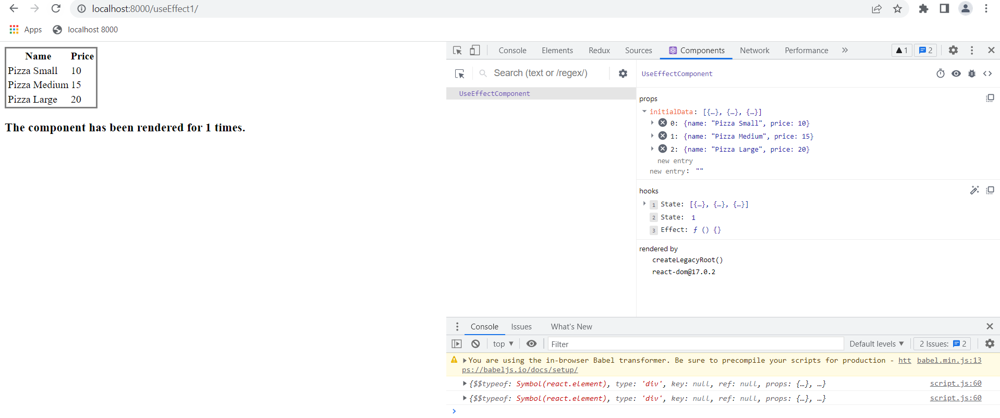
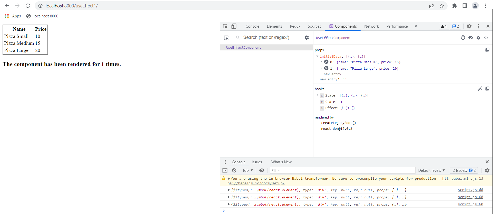
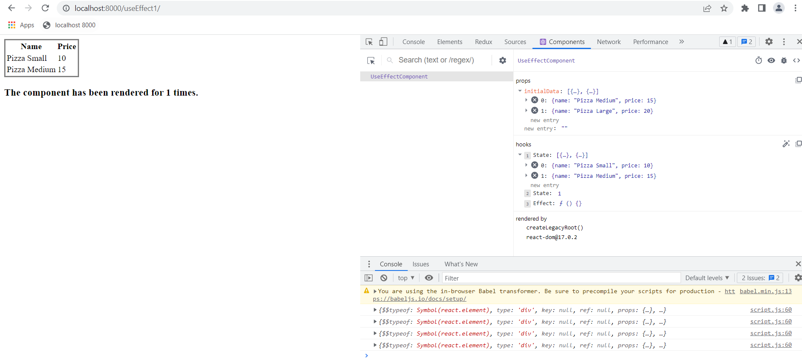

### Initialize the dependency for useEffect as an empty array

```js
useEffect(() => {
  setData(initialData);
  setCount(count + 1);
}, []);
```

Initially, the page is loaded with all the data


If we modify the value for initialData in the Developer Components tab, **it won't affect** the component behavior.


This isn't the case if we modify the state itself.

