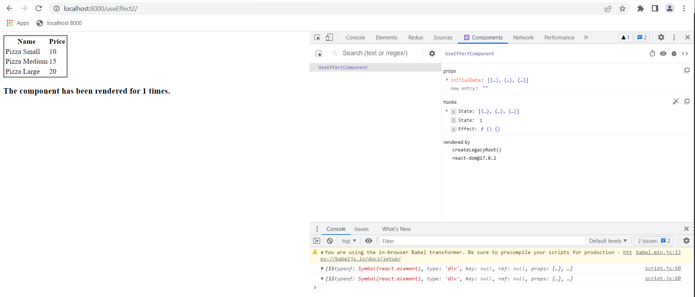
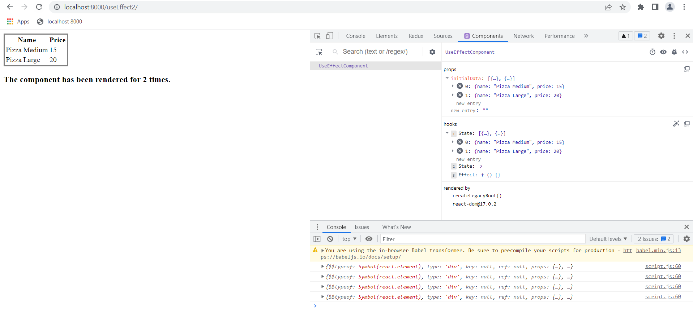
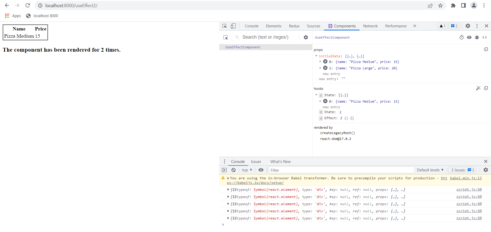

### Initialize the dependency for useEffect using the props value as an array

```js
useEffect(() => {
  setData(initialData);
  setCount(count + 1);
}, [initialData]);
```

Initially, the page is loaded with all the data


If we modify the value for initialData in the Developer Components tab, **it will affect** the component behavior.


This is the case if we modify the state too.

