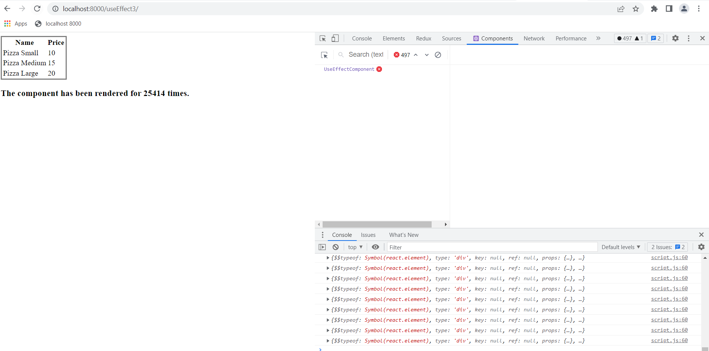

### Initialize the dependency for useEffect using only some of the state variables / Don't initialize at all the dependency for useEffect

```js
useEffect(() => {
  setData(initialData);
  setCount(count + 1);
});
```

```js
useEffect(() => {
  setData(initialData);
  setCount(count + 1);
}, [count]);
```

<span style="background-color:red; color: white;">Just from beginning, the page is loaded infinitely. </span>


